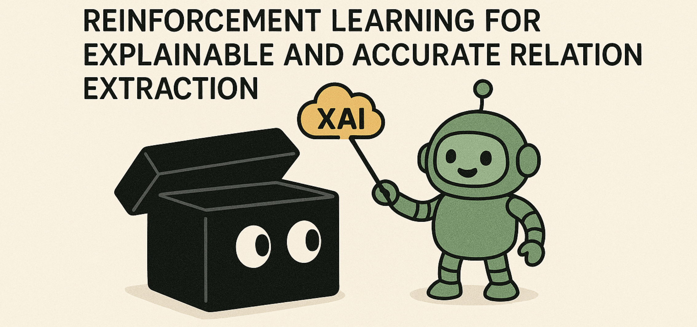
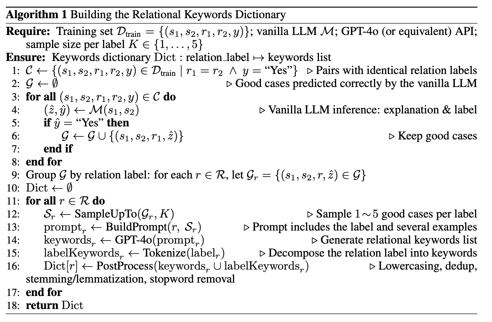
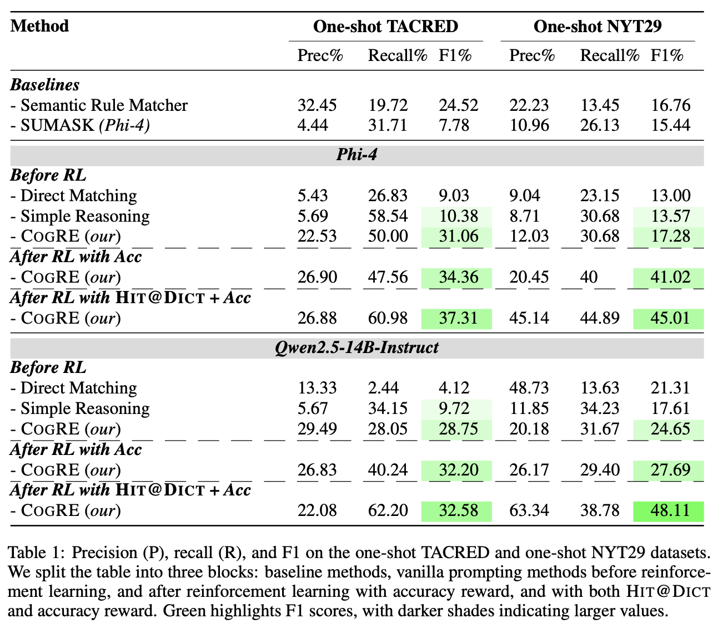

<div align="center">
   <h1>Peeking inside the Black-Box: Reinforcement Learning for Explainable and Accurate Relation Extraction</h1>
</div>

</div>

Relation Extraction (RE) is fundamental and long-studied but still has limited explainability. Our project introduces a novel framework named Cognitive-Structured for Relation Extraction (CogRE) that that jointly optimizes task accuracy and explainability. We optimize this framework with reinforcement learning (RL) with a novel reward mechanism, namely Hit@Dict, that jointly judges task accuracy and the quality of the corresponding explanation.


## Environment Setup

We provide two conda environment files under the `env/` directory:

- **icl-env.yml**: Lightweight environment for **testing / inference**.  
- **verl-re.yml**: Full environment for **training** the CogRE framework with Hit@Dit RL.

To create and activate the environments:

```bash
# For testing / inference
conda env create -f env/icl-env.yml
conda activate icl-env

# For training
conda env create -f env/verl-re.yml
conda activate verl-re
```

Our RL training is built upon the **VERL** architecture.  
For more details on environment requirements, please refer to the [VERL installation guide](https://verl.readthedocs.io/en/latest/start/install.html#requirements).


# Dataset

## Download raw dataset


| Dataset         | Note                                                         |                             Link                             |
| :-------------- | :----------------------------------------------------------- | :----------------------------------------------------------: |
| Few-shot NYT    | [Towards Realistic Few-Shot Relation Extraction A New Meta Dataset and Evaluation](https://arxiv.org/pdf/2404.04445) | [GoogleDrive](https://drive.google.com/file/d/1sPXO3xV8phUn48CZPuYsSQ8a-SRrGGl3/view?usp=sharing) |
| Few-shot TACRED | [FewRel: A Large-Scale Supervised Few-Shot Relation Classification](https://arxiv.org/pdf/1810.10147) | [LDC TACRED webpage](https://catalog.ldc.upenn.edu/LDC2018T24) |

## Sampled Datasets

We sample **20K instances** from the raw dataset **training partition** as our training data.  
From the **dev/testing partition**, we sample **1000 episodes** as our development and testing data.  

The sampled data is stored in:
`src/data_prepare/datasets`

### Data Building
To build these sampled datasets, we provide scripts under:
`src/data_prepare/datasets_builder`

- `generate_train_val_data_tacred.sh`: processes the raw TACRED dataset into the required format.
- `sample_training_NTY29.py`: applies our training set sampling algorithm on the processed NYT29 data.
- `sample_training_TACRED.py`: applies our training set sampling algorithm on the processed TACRED data.

## Unified the format (Sampled Data)
```json
{
  "paraphrased_sentence": "US captures suspected Iraqi aide of Iranian unit The `` highly-sought individual is suspected of being an Iranian Revolutionary Guards Corps-Quds ( IRGC-QF ) affiliate , '' the military said in a statement without revealing the detainee 's identity but adding later that he was an Iraqi .",
  "paraphrased_sentence_subject": "Iranian Revolutionary Guards Corps-Quds",
  "paraphrased_sentence_object": "IRGC-QF",
  "test_sentence": "He added that the company aims to further expand its business this year as it has won approval from the Mainland Affairs Council ( MAC ) to set up offices in Beijing and Shanghai .",
  "test_sentence_subject": "MAC",
  "test_sentence_object": "Mainland Affairs Council",
  "ss_relation": "org:alternate_names",
  "ts_relation": "org:alternate_names",
  "label": "Yes"
}
```


# Our method

## Build Relational Keywords Dictionary

To build the relational keywords dictionary, follow the step-by-step code files located in:
`src/dictionary_build/generate_keywords_for_each_relation_label`

These scripts guide the construction of a dictionary that maps each relation label to its associated keywords.  
The overall algorithmic workflow is illustrated in the figure below:




## Training Step

We implement our reinforcement learning (RL) training with the [VERL](https://verl.readthedocs.io/) library.


### Training Data Process

The script `src/tuning/verl-re/verl/examples/data_preprocess/1-shot-tacred-train-weighted_reward_with_keywords-sum_keywords_reasoning.py`  
implements the data processing pipeline. By switching the `data_source` flag, you can align the dataset with different reward functions.


### Reward Function

Our reward functions are implemented in:
`src/tuning/verl-re/verl/verl/utils/reward_score`

- `__init__.py`: handles reward registration.
- `one_shot_tacred_train_weighted_reward_with_keywords.py`: implements Hit@Dict + Accuracy reward.
- `one_shot_tacred_train.py`: implements Accuracy reward.

### Training Script

The training scripts are located at:
- `src/tuning/verl-re/verl/examples/grpo_trainer/run-TACRED_re_one-shot-tacred-weighted-reward-with-keywords_8_GPU-sum_keywords_reasoning-20k-1-7.sh`
- `src/tuning/verl-re/verl/examples/grpo_trainer/run-NYT29_re_one-shot-tacred-weighted-reward-with-keywords_8_GPU-sum_keywords_reasoning-20k-1-7.sh`

The default parameters in these scripts are the ones we used for our experiments.  
You can adjust them as needed based on your available resources and dataset.


## Evaluation Step

The evaluation code is located in `src/eval`:

- `_prepare.py`: Prepares the test data by organizing it into batched prompt formats. You can choose from several predefined prompt settings.
- `_inference.py`: Loads the model, runs inference, and stores the generated answers and results.
- `_compute.py`: Uses the `.jsonl` output file from the inference step (replace `file_path` accordingly) and computes the maximum `f1_tacred`.


# Evaluation on Benchmarks

We adopt a dual evaluation protocol on both automatic and human evaluation.
We use the `F1`as the automatic evaluation metric.

The main automatic experiment results are as follows:


